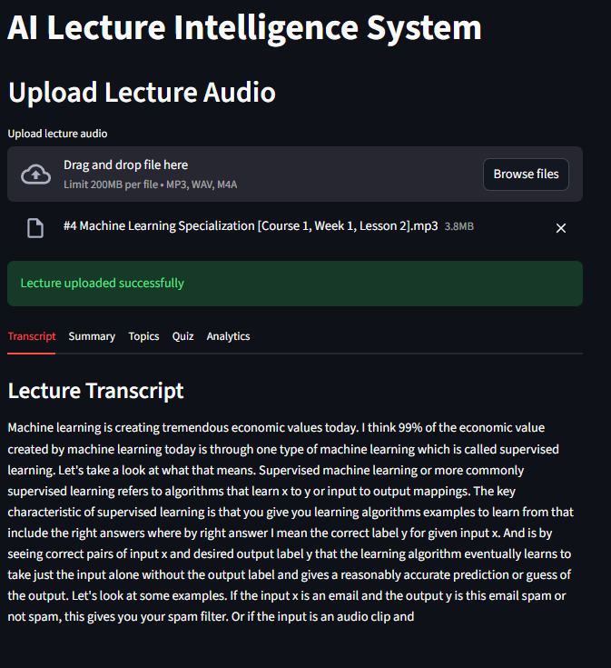
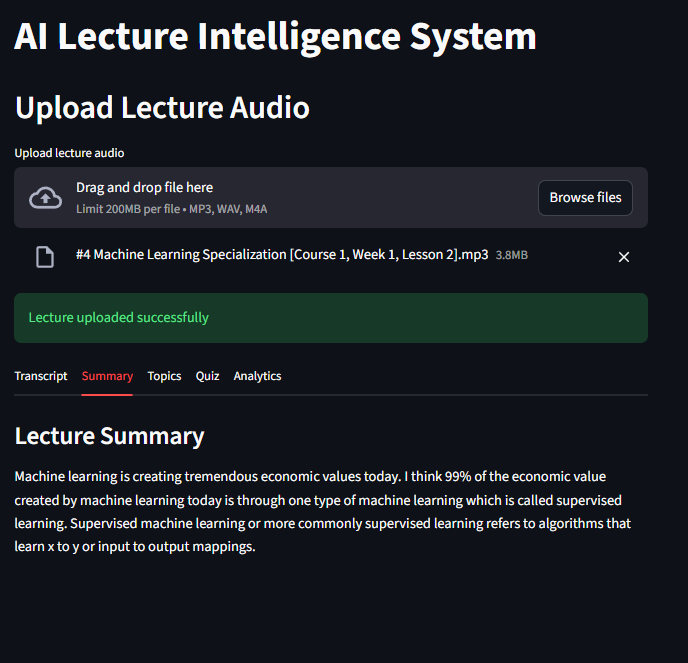
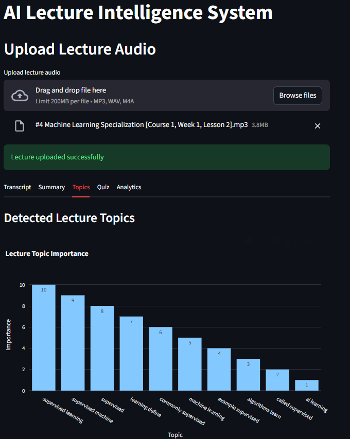
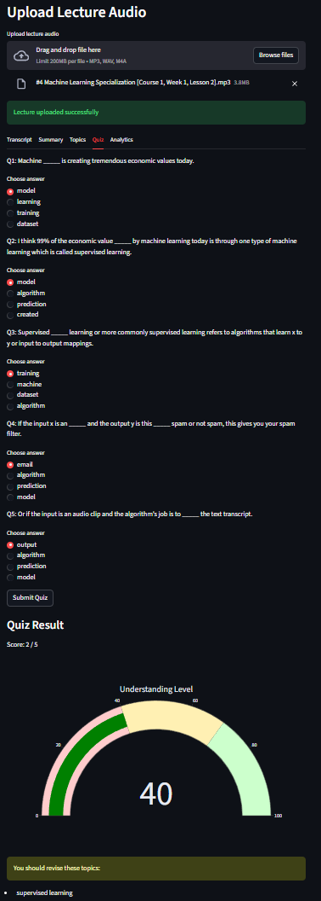
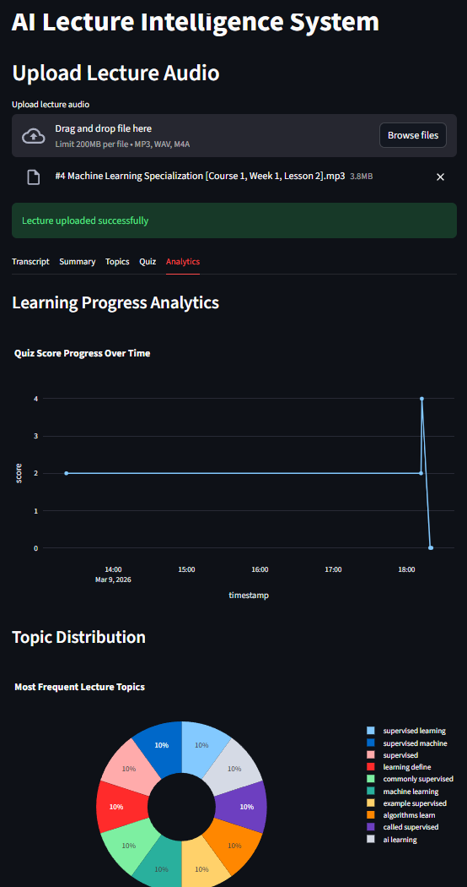

# AI Lecture Intelligence & Adaptive Quiz System

<p align="center">

</p>

<p align="center">

<a href="https://ai-lecture-intelligence-adaptive-quiz-system.streamlit.app/">

</a>


</p>

---

# Live Demo

🚀 Try the application

https://ai-lecture-intelligence-adaptive-quiz-system.streamlit.app/

---

# Overview

Students often attend lectures but struggle to **retain important concepts**.

This project builds an **AI-powered lecture intelligence system** that converts lecture audio into structured learning material.

The system automatically:

- Transcribes lecture audio
- Generates lecture summaries
- Detects key topics
- Creates quiz questions
- Evaluates student understanding
- Identifies weak learning areas

All features are delivered through an **interactive Streamlit dashboard**.

---

# Features

## Speech-to-Text Lecture Transcription

Uses **OpenAI Whisper** to convert lecture audio into text.

Supported formats:

- MP3
- WAV
- M4A

Pipeline:

```
Audio Lecture → Whisper → Transcript
```

---

## Automatic Lecture Summary

The system extracts the most informative sentences from the lecture transcript to generate a concise summary.

This allows students to quickly review the lecture content.

---

## Topic Detection

Uses **KeyBERT** to extract important lecture topics.

Example topics detected:

- Supervised learning
- Machine learning algorithms
- Input-output mapping
- Model training

These topics help identify the key concepts discussed in the lecture.

---

## Automatic Quiz Generation

The system automatically creates quiz questions from lecture content.

Question generation process:

```
Transcript
   ↓
Sentence Selection
   ↓
Keyword Extraction
   ↓
MCQ Generation
```

Each question includes:

- A fill-in-the-blank statement
- Multiple answer options
- Correct answer tracking

---

## Interactive Quiz Interface

Students can test their understanding directly in the app.

Features include:

- Multiple choice questions
- Interactive answer selection
- Immediate quiz scoring
- Learning feedback

---

## Weak Topic Detection

If a student answers incorrectly, the system analyzes which **lecture topics were involved in the question**.

The system then recommends topics to review.

Example output:

```
Score: 3 / 5

You should revise:
- supervised learning
- machine learning models
```

---

## Learning Analytics

Quiz results are stored for analysis.

Saved data includes:

- Score
- Topics covered
- Timestamp

Stored in:

```
outputs/results.json
```

This allows tracking learning progress over time.

---

# System Architecture

```
User
 │
 ▼
Streamlit Dashboard
 │
 ▼
Audio Upload
 │
 ▼
Speech Recognition
(Whisper)
 │
 ▼
Lecture Transcript
 │
 ▼
Summary Generator
 │
 ▼
Topic Detection
(KeyBERT)
 │
 ▼
MCQ Generator
 │
 ▼
Quiz Interface
 │
 ▼
Performance Analyzer
 │
 ▼
Learning Feedback
 │
 ▼
Results Storage
```

---

# Project Structure

```
AI_Lecture_Intelligence_System
│
├── app
│   └── streamlit_app.py
│
├── outputs
│   └── results.json
│
├── notebooks
│   ├── whisper_transcription.ipynb
│   └── topic_detection.ipynb
│
├── requirements.txt
├── packages.txt
└── README.md
```

---

# Installation

Clone repository

```bash
git clone https://github.com/Aditya-227/AI_Lecture_Intelligence_System.git
```

Navigate to project

```bash
cd AI_Lecture_Intelligence_System
```

Create virtual environment

```bash
python -m venv venv
```

Activate environment

Windows

```bash
venv\Scripts\activate
```

Linux / Mac

```bash
source venv/bin/activate
```

Install dependencies

```bash
pip install -r requirements.txt
```

---

# Run Application

```bash
streamlit run app/streamlit_app.py
```

Open

```
http://localhost:8501
```

---

# Deployment

This application is deployed using **Streamlit Community Cloud**.

Steps:

1 Push code to GitHub  
2 Open

```
https://share.streamlit.io
```

3 Deploy using

```
app/streamlit_app.py
```

4 Add system dependency

```
packages.txt
```

with

```
ffmpeg
```

---

# Screenshots












---

# Future Improvements

- Adaptive quiz difficulty
- Lecture topic knowledge graph
- Personalized revision plans
- Student performance dashboard
- LLM-based question generation
- Multi-lecture learning analytics

---

# Author

Aditya Verma

GitHub

```
https://github.com/Aditya-227
```

---

⭐ If you like this project, give it a star on GitHub.
